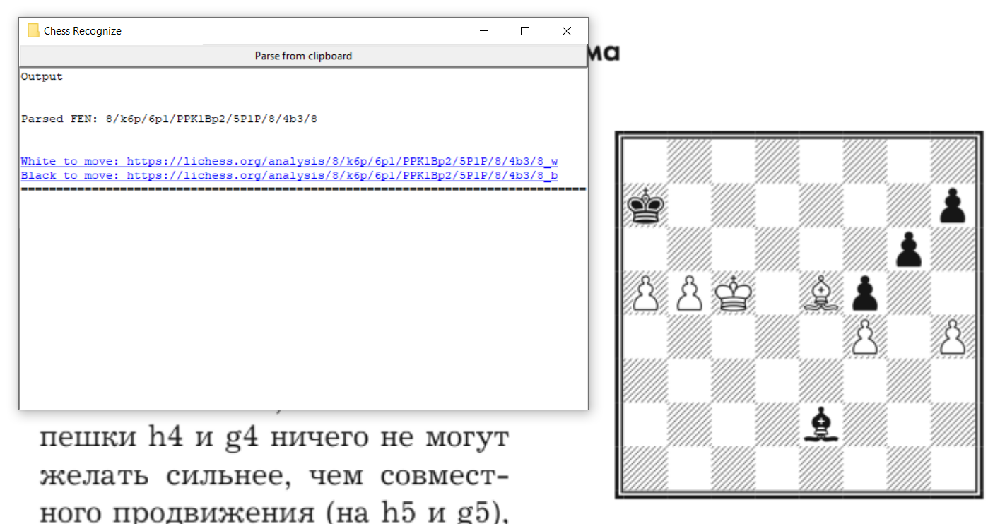

# Chess recognize

Parse FEN from clipboard image and analyse on https://lichess.org

---
## Desktop application



See [releases page](releases) for executable files

Build with TkInter

### Creating release

```
pyinstaller --onefile --clean "Chess Parser.spec"
```

## Development

### Setting up the virtual environment

This uses Python 3.10 (see `.python-version`), pip3 and virtualenv, if you don't have these installed you can use:

```
sudo apt-get install python3-pip
sudo pip3 install virtualenv
```

Then, create a new virtual environment, source it, and install the dependencies from `requirements.txt`.

```
virtualenv venv
source venv/bin/activate
pip3 install -r requirements.txt 
```

### Debug run

```
python src/main.py
```